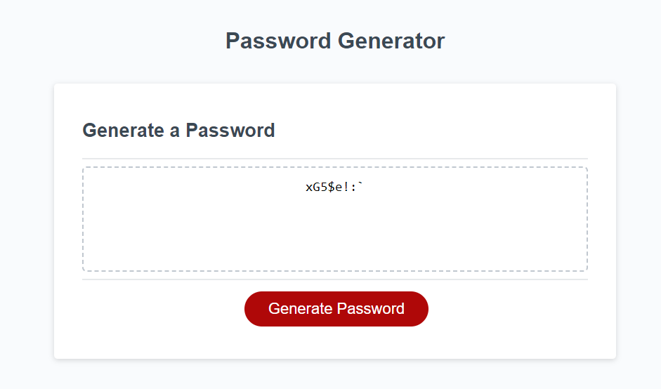

# Password Generator

## Description
This website allows the user to generate a password from length 8 to 128 and choose to include uppercase letters, lowercase letters, numbers, and special characters. I learned basic javascript to create this application.

## Installation
Link: https://kitdhing.github.io/pw-generator/

## Usage
For this application, you can click the link in installation to go to the webpage. Once there, you can press generate password which will present the user a series of prompts for them to answer for the password to be made.

# Credits
N/A

# License 
Please refer to the license in the repo

# Build Settings
Link: https://kitdhing.github.io/pw-generator/

